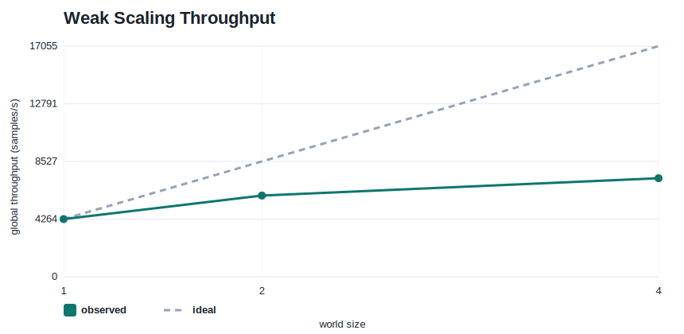
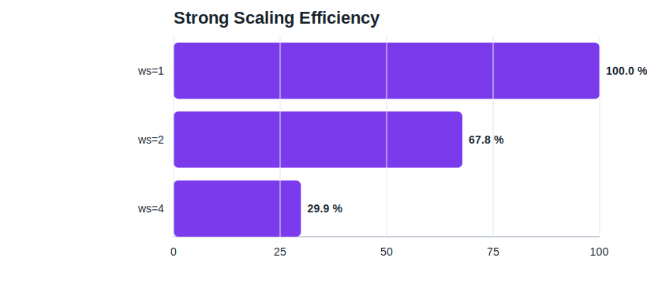
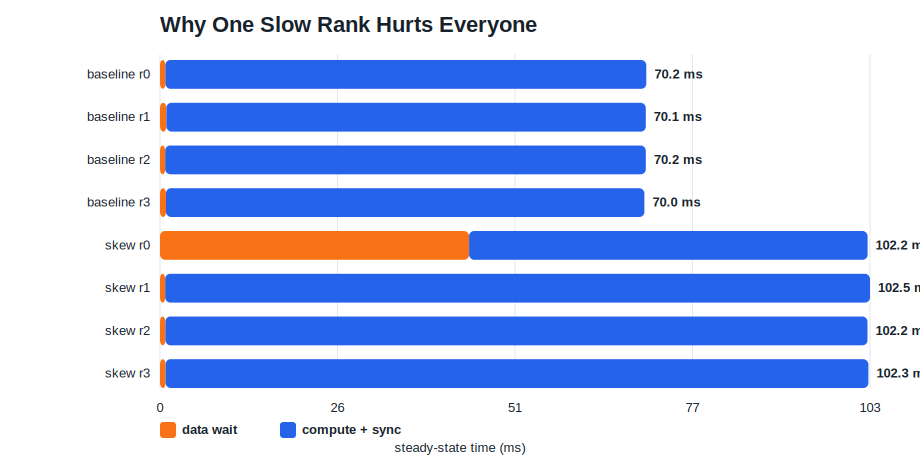
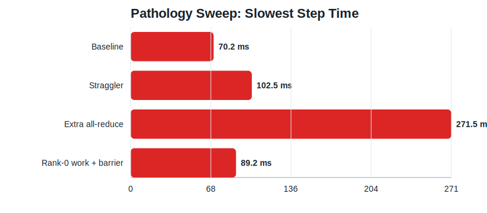
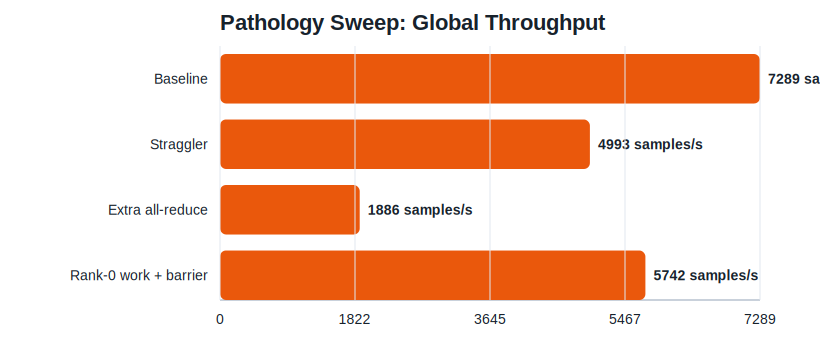

# Learning PyTorch DDP Performance Tuning on a One-GPU Machine

How to build real intuition for `DistributedDataParallel` scaling, stragglers, communication, and synchronization even when you only have one GPU.

## TL;DR

Most DDP performance problems are easier to understand than they first look.

In this post I built a small single-machine lab that uses CPU `gloo` processes to reproduce the part of DDP reasoning that matters most:

- the slowest rank often sets the pace
- small per-rank work hurts scaling
- communication can dominate step time
- rank-0-only host work becomes everyone’s problem once you synchronize

The important numbers from the lab were:

- weak scaling from `ws=1` to `ws=4` only delivered `42.7%` efficiency
- strong scaling efficiency fell from `67.8%` at `ws=2` to `29.9%` at `ws=4`
- adding a straggler rank cut throughput from `7,289` to `4,993 samples/s` (`-31.5%`)
- adding an extra `128 MB` all-reduce cut throughput to `1,886 samples/s` (`-74.1%`)
- simulating rank-0-only work followed by a barrier still cut throughput by `21.2%`

The main lesson is simple:

> DDP is not just about making one rank fast. It is about keeping all ranks busy, aligned, and overlapped.

## Why This Post Exists

Most DDP tuning advice assumes you already have a multi-GPU box.

That is reasonable for final measurement, but it is not a great way to learn. If you only meet DDP on a real cluster, a bad trace can feel like noise: several ranks, several streams, communication, host jitter, and no obvious place to start.

I wanted a smaller lab that teaches the reasoning first.

So instead of pretending one GPU can reproduce NCCL or NVLink behavior, I leaned into what one machine can still teach honestly:

- how scaling metrics are defined
- why strong and weak scaling behave differently
- what a straggler rank does to everyone else
- why synchronization points are dangerous
- how extra collective work changes the shape of a step

That is enough to build the mental model you need before you ever touch a real multi-GPU training job.

## Setup

All runs in this post came from the local machine behind this repo:

- CPU: `AMD Ryzen 9 9900X 12-Core Processor`
- GPU: `NVIDIA GeForce RTX 5080`
- PyTorch: `2.10.0+cu128`
- CUDA runtime reported by PyTorch: `12.8`
- OS: WSL2

The actual DDP lab in this post runs on CPU with `gloo`, on purpose. That keeps the experiment reproducible on a one-GPU machine while preserving the distributed behaviors I care about.

The code lives here:

- lab workload: [ddp_lab.py](../python/playground_cuda/ddp_lab.py)
- experiment runner: [ddp_lab_blog_experiments.py](../python/playground_cuda/ddp_lab_blog_experiments.py)

The generated artifacts for this article are checked in:

- timing table: [timings.csv](../reports/ddp_lab_blog/timings.csv)
- structured summaries: [results.json](../reports/ddp_lab_blog/results.json)
- chart directory: [reports/ddp_lab_blog/charts](../reports/ddp_lab_blog/charts)
- raw logs:
  - [weak_ws1.log](../reports/ddp_lab_blog/weak_ws1.log)
  - [weak_ws2.log](../reports/ddp_lab_blog/weak_ws2.log)
  - [weak_ws4.log](../reports/ddp_lab_blog/weak_ws4.log)
  - [strong_ws1.log](../reports/ddp_lab_blog/strong_ws1.log)
  - [strong_ws2.log](../reports/ddp_lab_blog/strong_ws2.log)
  - [skew_ws4.log](../reports/ddp_lab_blog/skew_ws4.log)
  - [comm_ws4.log](../reports/ddp_lab_blog/comm_ws4.log)
  - [barrier_ws4.log](../reports/ddp_lab_blog/barrier_ws4.log)

## The Lab

The lab is deliberately simple: synthetic data, a medium-sized MLP, and a handful of modes that each emphasize one DDP behavior.

The model and distributed setup are unremarkable by design:

```python
model = torch.nn.Sequential(
    torch.nn.Linear(args.input_dim, args.hidden_dim),
    torch.nn.GELU(),
    torch.nn.Linear(args.hidden_dim, args.hidden_dim),
    torch.nn.GELU(),
    torch.nn.Linear(args.hidden_dim, args.num_classes),
)
model = DDP(model)
optimizer = torch.optim.AdamW(model.parameters(), lr=1e-3)
```

The input path is properly sharded:

```python
sampler = torch.utils.data.distributed.DistributedSampler(
    dataset,
    num_replicas=world_size,
    rank=rank,
    shuffle=True,
    drop_last=True,
)
```

The interesting part is that the lab can inject pathologies on demand.

To create a straggler:

```python
if args.mode == "skew" and rank == args.slow_rank:
    time.sleep(args.sleep_ms / 1000.0)
```

To add extra communication:

```python
if args.mode == "comm":
    element_count = max(1, args.comm_mb * 1024 * 1024 // 4)
    buffer = torch.ones(element_count, dtype=torch.float32)
    dist.all_reduce(buffer)
```

To simulate the very common “rank 0 does host work, then everyone waits” bug:

```python
if args.mode == "barrier" and (step + 1) % args.barrier_every == 0:
    if rank == 0 and args.barrier_sleep_ms > 0:
        time.sleep(args.barrier_sleep_ms / 1000.0)
    dist.barrier()
```

That last one matters a lot in real jobs. It is a decent stand-in for checkpoint bookkeeping, evaluation setup, heavyweight logging, or any other rank-0-only host work that gets pulled into the critical path by synchronization.

## How I Measured

I used one experiment runner to generate all numbers and charts:

```bash
uv run python -m playground_cuda.ddp_lab_blog_experiments
```

It runs eight cases:

- weak scaling with `world_size = 1, 2, 4` at fixed per-rank batch `128`
- strong scaling with fixed global batch `512`
- a `ws=4` straggler case
- a `ws=4` extra-all-reduce case
- a `ws=4` rank-0-work-plus-barrier case

For each case I collected:

- slowest steady-state rank
- slowest steady-state step time
- global throughput
- average per-step rank spread
- per-rank data wait time
- per-rank compute-plus-sync time

I skipped the first two steps when computing steady-state summaries.

## The Result Table

These are the headline numbers from [timings.csv](../reports/ddp_lab_blog/timings.csv).

| Case | World size | Per-rank batch | Slowest step ms | Throughput samples/s | Main takeaway |
| --- | ---: | ---: | ---: | ---: | --- |
| Weak scaling | 1 | 128 | 30.0 | 4,264 | Reference point |
| Weak scaling | 2 | 128 | 42.6 | 6,004 | Throughput rises, but not linearly |
| Weak scaling | 4 | 128 | 70.2 | 7,289 | More ranks, much longer step |
| Strong scaling | 1 | 512 | 84.0 | 6,096 | Fixed-work baseline |
| Strong scaling | 2 | 256 | 62.0 | 8,263 | Some speedup, decent efficiency |
| Strong scaling | 4 | 128 | 70.2 | 7,289 | More ranks actually hurts this setup |
| Straggler rank | 4 | 128 | 102.5 | 4,993 | One slow rank drags the job down |
| Extra all-reduce | 4 | 128 | 271.5 | 1,886 | Communication dominates |
| Rank-0 work + barrier | 4 | 128 | 89.2 | 5,742 | Host-side serialization still hurts |

The rest of the post is really just explaining why these numbers make sense.

## Experiment 1: Weak Scaling Tells You Whether More Ranks Buy More Work

Weak scaling keeps per-rank batch size fixed.

That means the right question is:

> If every rank does the same amount of work as before, does global throughput rise roughly with world size?

Here is the throughput chart:



Observed throughput:

- `ws=1`: `4,264 samples/s`
- `ws=2`: `6,004 samples/s`
- `ws=4`: `7,289 samples/s`

Compared with ideal linear scaling, that is:

- `70.4%` efficiency at `ws=2`
- `42.7%` efficiency at `ws=4`

There are two reasons I like this chart.

First, it makes the definition of weak scaling concrete. The dashed line is the story you wanted. The solid line is the story you actually got.

Second, it forces the right follow-up question. Once the solid line bends away from ideal, you stop asking “is DDP working?” and start asking “what is eating the missing throughput?”

On a real multi-GPU system that missing throughput could come from:

- communication overhead
- poor overlap between backward and all-reduce
- rank-local data skew
- host-side orchestration overhead

In this CPU lab it mostly comes from distributed coordination and process overhead, which is enough to teach the shape of the problem.

## Experiment 2: Strong Scaling Exposes the Small-Batch Trap

Strong scaling keeps the global batch fixed.

That means per-rank work shrinks as you add ranks. This is where many DDP jobs disappoint people for completely predictable reasons.

Here is the chart:



The measured efficiencies were:

- `ws=2`: `67.8%`
- `ws=4`: `29.9%`

The raw step times make the story even clearer:

- `ws=1`, global batch `512`: `84.0 ms`
- `ws=2`, per-rank batch `256`: `62.0 ms`
- `ws=4`, per-rank batch `128`: `70.2 ms`

The surprising part is that `ws=4` is worse than `ws=2`, even though there are more ranks helping.

That is the core strong-scaling lesson:

> Once per-rank compute gets too small, coordination costs stop looking like overhead and start looking like the job.

This is exactly why DDP can look great in weak scaling and disappointing in strong scaling. The workload did not become “harder.” The ratio between useful compute and unavoidable distributed work got worse.

If I saw this shape on a real job, the first knobs I would reach for are:

- larger per-rank batch size
- gradient accumulation to restore effective work per synchronization
- reducing unnecessary synchronization or graph bookkeeping

## Experiment 3: One Slow Rank Really Does Hurt Everyone

The straggler case adds `40 ms` of host delay to rank 0 before it fetches each batch.

At first glance you might think the damage should stay local to that rank. It does not.

Here is the breakdown:



The most important numbers are:

- baseline `ws=4` throughput: `7,289 samples/s`
- straggler throughput: `4,993 samples/s`
- throughput drop: `31.5%`

And the per-rank breakdown explains why:

- rank 0 data wait jumps from about `0.8 ms` to `44.6 ms`
- rank 0 compute-plus-sync drops to about `57.5 ms`
- the other ranks keep tiny data time, but their compute-plus-sync inflates to about `101 ms`

That last bullet is the one people often miss.

The “fast” ranks are not actually winning. They finish their local work earlier and then spend the difference waiting at distributed synchronization points. In the summary log for this case, all four ranks end up with step times around `102 ms` even though only one of them had the slow input path.

This is the DDP mental model in one picture:

> A straggler does not just make itself slow. It converts everyone else’s idle time into distributed waiting.

If you are looking at a real multi-GPU trace and several ranks appear “compute-heavy,” do not assume they all have the same root cause. Sometimes one rank is late and the others are only late because they are trapped behind it.

One of the most common real-world sources of this problem is transformer training with variable sequence lengths.

If one rank gets a batch whose total token count is much larger than the others, that rank usually pays more for:

- CPU-side collation and padding
- host-to-device transfer volume
- attention and MLP compute
- activation memory traffic

That means "same batch size" does not imply "same work." In practice, DDP skew is often caused by uneven tokens per batch, not uneven examples per batch.

For transformer jobs, I would explicitly check:

- tokens per batch per rank
- padded length distribution
- whether batches are built by fixed example count instead of fixed token budget
- whether one worker is repeatedly getting longer documents or conversations

The usual fixes are also more data-centric than kernel-centric:

- bucket by sequence length
- batch by token budget instead of sample count
- cap pathological sequence lengths
- reduce padding waste with smarter collation
- monitor per-rank tokens/s, not just samples/s

## Experiment 4: Communication and Synchronization Failures Look Different

The last two pathologies are worth grouping together because they both make the step slower, but for different reasons.

Here is the step-time chart:



And here is the throughput view:



### Extra all-reduce

In the communication case I inserted an extra `128 MB` all-reduce every step.

That pushed the job from:

- `70.2 ms` to `271.5 ms` per step
- `7,289` to `1,886 samples/s`

That is a `74.1%` throughput collapse.

What matters here is not just that the job got slower. It is that the slowdown was broad and uniform:

- all ranks stayed close to `270 ms`
- data time stayed tiny
- compute-plus-sync ballooned for everyone

This is a classic sign that the regression is not “one rank is weird.” It is “everyone is paying the same extra distributed tax.”

### Rank-0 work plus barrier

In the last case I made rank 0 do `20 ms` of host-side work before a barrier every step.

That still pushed the job from:

- `70.2 ms` to `89.2 ms`
- `7,289` to `5,742 samples/s`

That is a `21.2%` throughput loss from something that is not even model compute.

This is one of my favorite DDP failure modes because it is so mundane. You do not need a broken NCCL setup to waste a lot of throughput. Sometimes the whole cluster is waiting because rank 0 is busy formatting logs, touching the filesystem, or preparing a checkpoint.

## Transformer and LLM Jobs: The Real Skew Is Usually Tokens, Not Samples

If I had to name one DDP pathology that shows up constantly in transformer training, it would be this:

> the ranks are balanced by sample count, but wildly unbalanced by token count

I wrote a separate experiment-driven follow-up focused entirely on this problem at [pytorch_transformer_token_skew_blog.md](../docs/pytorch_transformer_token_skew_blog.md).

That happens because sequence length changes the amount of work in several places at once:

- CPU collation and padding cost
- host-to-device transfer size
- attention FLOPs
- MLP FLOPs
- activation memory traffic
- backward time

So even if every rank gets `batch_size=8`, the step can still be badly imbalanced if one rank gets `8 x 512` tokens and another gets `8 x 4096`.

In other words, the real unit of work is often not examples per batch. It is total tokens per batch.

### What This Looks Like in Practice

A very common anti-pattern is batching by fixed sample count:

```python
loader = DataLoader(
    dataset,
    batch_size=per_rank_batch_size,
    sampler=sampler,
    collate_fn=collate_fn,
)
```

This is simple, but for variable-length text it can create huge step-to-step and rank-to-rank variance.

The symptom cluster is usually:

- per-rank `samples/s` looks fine, but `tokens/s` swings a lot
- one rank repeatedly reaches backward or all-reduce later than others
- GPU utilization looks noisy even though kernels themselves are healthy
- padding ratio is high and unstable across steps

### The Metrics I Would Add Immediately

For transformer jobs, I would log these per rank:

- total input tokens per step
- padded tokens per step
- padding ratio
- tokens/s
- max sequence length in batch
- step time p50 and p95

This is the fastest way to catch the “same number of samples, different amount of work” bug.

If you only monitor examples/s, you can completely miss the real imbalance.

### The First Fixes I Would Try

#### 1. Batch by token budget, not by sample count

Instead of "8 samples per rank," aim for something like "32k tokens per rank."

That usually makes the work much more uniform across ranks.

#### 2. Bucket by sequence length

Sort or bucket examples by length before batching so that each batch contains similarly sized sequences.

This lowers both skew and padding waste.

#### 3. Use packing when the task allows it

For next-token prediction or other causal LM setups, packing multiple short sequences into one training example can dramatically improve token utilization.

That reduces the amount of dead padded work you are distributing across ranks.

#### 4. Cap pathological outliers

Very long documents, conversations, or prompts can dominate a step all by themselves.

If the training objective allows it, truncation or chunking is often better than letting rare outliers become distributed stragglers.

### A Better Mental Model for Transformer Batching

For many DDP transformer jobs, the real scaling question is not:

- did every rank get the same number of samples?

It is:

- did every rank get roughly the same number of useful tokens?

That is why `tokens/s` is often the better top-line metric than `samples/s`.

`samples/s` is still useful, but `tokens/s` tracks the actual compute and memory load much more closely.

### A Minimal Token-Budget Sketch

This is not a full production sampler, but it shows the idea:

```python
def make_batches(indices, lengths, max_tokens):
    batch = []
    batch_tokens = 0

    for index in indices:
        seq_len = lengths[index]
        projected = max(batch_tokens, seq_len * (len(batch) + 1))
        if batch and projected > max_tokens:
            yield batch
            batch = []
            batch_tokens = 0

        batch.append(index)
        batch_tokens = max(batch_tokens, seq_len) * len(batch)

    if batch:
        yield batch
```

The exact batching policy depends on the model and task, but the important part is the intent: constrain total padded token work, not just raw example count.

### How This Connects Back to the Straggler Experiment

The `skew` experiment in this repo injects delay with `sleep`, but the real transformer analogue is usually uneven token volume.

That is why the lab is still useful:

- the synthetic version teaches the waiting pattern
- the transformer version explains where that waiting pattern comes from in real jobs

If I were profiling a real LLM training run, one of the first overlays I would want on the timeline is:

- rank 0 tokens this step
- rank 1 tokens this step
- rank 2 tokens this step
- rank 3 tokens this step

When those diverge, the DDP trace often becomes much easier to explain.

## How I Would Read These Charts on a Real Job

These experiments are synthetic, but the reading order transfers cleanly.

### 1. Start with scaling, not kernels

If weak scaling is already bending away from ideal, or strong scaling efficiency collapses as per-rank batch shrinks, the problem is higher-level than a single CUDA kernel.

That narrows the search to:

- data input and skew
- communication volume
- overlap
- synchronization

### 2. Decide whether the slowdown is rank-local or global

The straggler case and the extra-all-reduce case both make the step slower, but they leave different fingerprints.

Straggler fingerprint:

- one rank has an obvious local delay
- other ranks accumulate time in wait-heavy compute/sync regions
- step times converge upward because everyone waits for the slowest

Communication fingerprint:

- all ranks slow down in a similar way
- data time stays small
- the step gets fatter everywhere

### 3. Treat rank-0-only work as performance-critical

In distributed training, “only rank 0 does it” is not the same as “it is cheap.”

The question is not who executes the code. The question is whether a synchronization point causes the rest of the job to inherit its latency.

## What This Teaches Before You Get a Multi-GPU Box

This one-machine lab does not replace real DDP measurement.

You still need multiple GPUs to faithfully study:

- NCCL bandwidth
- stream overlap between backward and all-reduce
- NVLink vs PCIe topology effects
- rank-local GPU memory pressure

But it does teach the part that many people skip:

- how to think about scaling efficiency
- how to reason about per-rank work
- how to recognize stragglers
- how to separate synchronization problems from kernel problems

That is exactly the intuition you need before opening `torch.profiler`, Nsight Systems, or Nsight Compute on a real distributed job.

When I eventually move this workflow to real multi-GPU training, the tool order stays the same:

1. measure throughput and per-rank step time
2. decide whether the shape looks like weak-scaling loss, strong-scaling loss, or a straggler
3. use `torch.profiler` for top-down classification
4. use `nsys` to inspect cross-rank timing and overlap
5. use `ncu` only for the hot kernels that still matter after the distributed picture is clear

## Reproducing Everything

Regenerate the full dataset and charts:

```bash
uv run python -m playground_cuda.ddp_lab_blog_experiments
```

Run a single case directly:

```bash
uv run python -m torch.distributed.run --standalone --nproc_per_node=4 \
  -m playground_cuda.ddp_lab --mode skew --steps 12 --batch-size 128 --sleep-ms 40
```

Or the synchronization case:

```bash
uv run python -m torch.distributed.run --standalone --nproc_per_node=4 \
  -m playground_cuda.ddp_lab --mode barrier --steps 12 --batch-size 128 \
  --barrier-every 1 --barrier-sleep-ms 20
```

## Closing Thought

The reason to do this kind of lab is not to pretend CPU `gloo` is the same as multi-GPU `nccl`.

It is to get good at asking better questions.

If you already understand that strong scaling can fail because per-rank work got too small, that a straggler can silently turn everyone else into waiters, and that rank-0 host work can leak into global step time, then you will walk into a real DDP trace with much better instincts.

That is usually the difference between staring at distributed profiles and actually debugging them.
