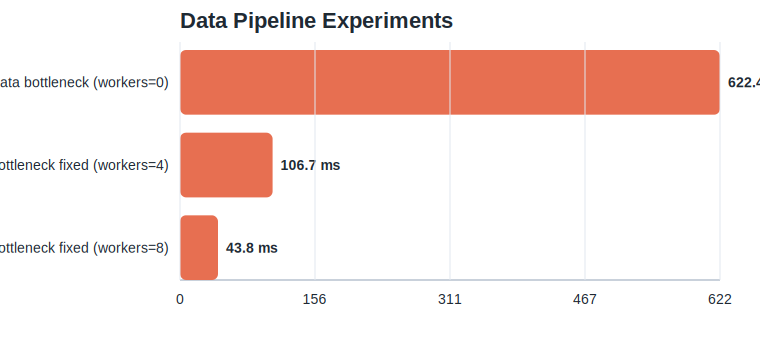
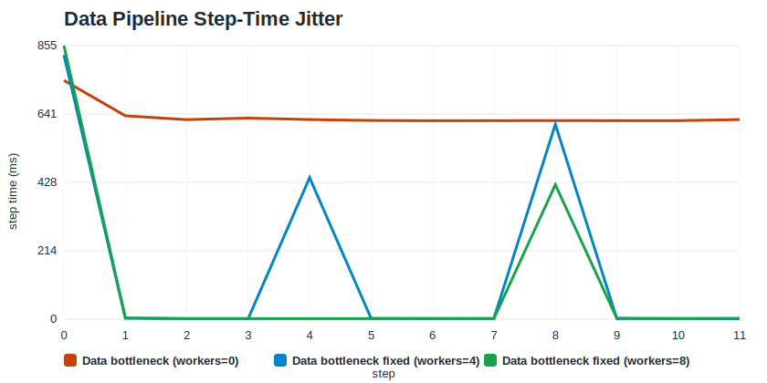
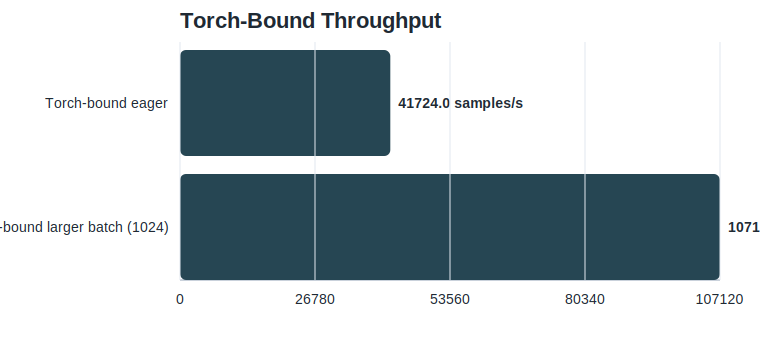
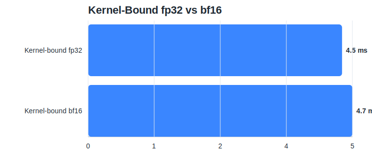

# Profiling a PyTorch Training Job End to End

How to decide whether a training job is blocked on data, PyTorch overhead, or a hot CUDA kernel, using `torch.profiler`, Nsight Systems, and Nsight Compute in the right order.

## TL;DR

When a PyTorch training job feels slow, the most expensive mistake is starting at the wrong layer.

In this case study, I built a small synthetic training lab and used it to force three common bottlenecks:

- a data-bound job
- a torch/eager-overhead-bound job
- a kernel-bound job

The main conclusions were straightforward:

- If `DataLoader` dominates self CPU time and CUDA time is tiny, optimize the input pipeline first.
- If `cudaLaunchKernel` is large and the profiler shows thousands of small `aten::` ops, you are paying for eager execution and launch overhead.
- If Nsight Compute shows high DRAM throughput and low compute throughput, the hot kernel is memory-bound, and mixed precision may not help.

The tool order mattered as much as the results:

1. Measure plain step time first.
2. Use `torch.profiler` to classify the bottleneck.
3. Use `nsys` to understand the whole-step timeline.
4. Use `ncu` only after you know which kernel family is actually hot.

That workflow consistently answered the question faster than jumping straight into kernel metrics.

## Why This Post Exists

Most performance debugging discussions start too deep.

The usual arc looks like this:

- the model is slow
- we open Nsight Compute
- we stare at occupancy, cache throughput, and DRAM utilization
- and only later realize the GPU was mostly idle because the data loader was starved

That is backwards.

This post is an intentionally controlled exercise in learning the opposite habit: start broad, classify the problem, then zoom in. The code is synthetic on purpose. I was not trying to build a meaningful model; I was trying to build a repeatable lab for learning how to reason about a real one.

## Setup

All numbers in this post were collected on the local machine backing this repo:

- GPU: `NVIDIA GeForce RTX 5080`
- Driver: `595.79`
- PyTorch: `torch 2.10.0+cu128`
- OS: WSL2 kernel `6.6.87.2-microsoft-standard-WSL2`

The training lab code lives in [training_lab.py](../python/playground_cuda/training_lab.py). The experiment runner that generated the charts and CSVs lives in [training_lab_blog_experiments.py](../python/playground_cuda/training_lab_blog_experiments.py). The full repo is published at [duoan/playground-cuda](https://github.com/duoan/playground-cuda).

The raw artifacts for this article are checked in:

- timing table: [timings.csv](../reports/training_lab_blog/timings.csv)
- structured run summaries: [results.json](../reports/training_lab_blog/results.json)
- charts: [reports/training_lab_blog/charts](../reports/training_lab_blog/charts)
- torch profiler outputs:
  - [blog_data_profile.txt](../reports/blog_data_profile.txt)
  - [blog_torch_profile.txt](../reports/blog_torch_profile.txt)
- Nsight Systems summary: [blog_torch_nsys_stats.txt](../reports/blog_torch_nsys_stats.txt)
- Nsight Compute summary: [blog_kernel_ncu.txt](../reports/blog_kernel_ncu.txt)

## The Workload

The lab exposes four presets:

- `baseline`: a small healthy-enough reference
- `data`: expensive CPU preprocessing and a slow input pipeline
- `torch`: a model with many tiny eager elementwise ops
- `kernel`: a model with repeated pointwise CUDA-heavy blocks

The three code fragments below are the important ones.

The input pipeline:

```python
loader = torch.utils.data.DataLoader(
    dataset,
    batch_size=args.batch_size,
    shuffle=True,
    num_workers=args.num_workers,
    pin_memory=use_cuda,
    persistent_workers=args.num_workers > 0,
)

features = features.to(device, non_blocking=use_cuda)
targets = targets.to(device, non_blocking=use_cuda)
```

The eager-overhead-heavy forward:

```python
for _ in range(self.micro_ops):
    x = torch.relu(x + 0.01)
    x = x * 0.99
    x = x + torch.sigmoid(x) * 0.01
```

The kernel-heavy forward:

```python
for _ in range(self.pointwise_depth):
    gate = torch.sigmoid(x)
    x = torch.nn.functional.gelu(x) * gate
    x = torch.nn.functional.layer_norm(x, (x.shape[-1],))
    x = x + 0.05
```

These patterns were chosen because they produce familiar profiler signatures:

- input stalls
- too many tiny launches
- memory-bound pointwise kernels

## Methodology

I used the same measurement rules for every experiment.

- I measured steady-state step time by skipping the first two steps.
- I kept the benchmark metric aligned with the optimization goal.
- For data and kernel experiments, step time was the main metric.
- For torch/eager-overhead experiments, throughput was the more useful metric.

That last point matters. A larger batch can increase step time while still improving throughput. If the goal is training throughput, that is still a win.

I generated the experiment matrix with:

```bash
uv run python -m playground_cuda.training_lab_blog_experiments
```

## The Result Table

These are the steady-state numbers from [timings.csv](../reports/training_lab_blog/timings.csv).

| Case | Steady-state step ms | p50 ms | Throughput samples/s | Main takeaway |
| --- | ---: | ---: | ---: | --- |
| Baseline | 3.20 | 3.45 | 79,947 | Healthy reference run |
| Data, workers=0 | 622.37 | 620.95 | 411 | Completely input-bound |
| Data, workers=4 | 106.70 | 1.99 | 2,399 | Faster on average, still bursty |
| Data, workers=8 | 43.79 | 1.69 | 5,846 | Better again, but starvation remains |
| Torch eager, batch=256 | 6.14 | 6.16 | 41,724 | Many tiny launches |
| Torch eager, batch=1024 | 9.56 | 8.46 | 107,120 | Higher step time, much higher throughput |
| Kernel fp32 | 4.49 | 3.93 | 114,004 | Best kernel-mode variant here |
| Kernel bf16 | 4.67 | 3.82 | 109,530 | Slight regression on this workload |

The table already suggests the main themes, but the charts make the reasoning much easier to see.

## Experiment 1: Diagnosing a Data Bottleneck

The data experiment was designed to answer the simplest possible question: what does an obviously input-bound training job look like when you profile it correctly?

The bar chart gives the first answer:



The step-time improvement was large:

- `workers=0 -> workers=4`: `622.37 ms -> 106.70 ms`, a `5.83x` improvement
- `workers=0 -> workers=8`: `622.37 ms -> 43.79 ms`, a `14.21x` improvement

If I stopped there, I would write a decent benchmark note. But the more interesting chart is the jitter chart:



This chart is the reason I kept both average and p50 in the dataset.

What it shows:

- `workers=4` has a tiny `p50` of `1.99 ms`, but the average is still `106.70 ms`
- `workers=8` has a tiny `p50` of `1.69 ms`, but the average is still `43.79 ms`
- most steps are fast, but the queue periodically drains and one step suddenly spikes into the hundreds of milliseconds

That is the first practical lesson of the post:

> For input pipelines, the median alone can lie.

If you only looked at p50, you would think the problem was solved at `num_workers=4`. The jitter chart makes it obvious that the system is still periodically starving the GPU.

### What `torch.profiler` Said

I profiled the slowest data case with:

```bash
uv run python -m playground_cuda.training_lab \
  --mode data \
  --steps 8 \
  --profile torch \
  --trace-dir traces/blog_data_profile
```

The strongest signals from [blog_data_profile.txt](../reports/blog_data_profile.txt) were:

- `enumerate(DataLoader)...` consumed `92.16%` of self CPU time
- total self CPU time was `3.960s`
- total self CUDA time was only `7.411ms`

That is exactly the profile I want to see before I decide not to touch kernels:

- the CPU is busy preparing batches
- the GPU is mostly waiting
- kernel-level tuning would be premature

### What I Would Optimize Next

The first optimization was already visible in the benchmark:

```python
loader = torch.utils.data.DataLoader(
    dataset,
    batch_size=args.batch_size,
    num_workers=args.num_workers,
    pin_memory=True,
    persistent_workers=args.num_workers > 0,
)

features = features.to(device, non_blocking=True)
```

If I were continuing this line of work on a real training job, the next steps would be:

- increase `num_workers` until the jitter curve stops improving
- reduce CPU transforms in `__getitem__`
- cache or precompute expensive preprocessing
- verify overlap between host-to-device copies and compute

The important point is not that `num_workers` helps. It is that the profiler made it obvious that the right place to work was the data path, not the kernel path.

## Experiment 2: Diagnosing Torch / Eager Overhead

The `torch` preset was designed to create the kind of workload that feels "GPU-ish" at a glance but is really dominated by lots of small ops and lots of launches.

Here the most useful chart is throughput, not step time:



The raw numbers were:

- batch `256`: `41,724 samples/s`
- batch `1024`: `107,120 samples/s`
- throughput improvement: `2.57x`

At the same time:

- batch `256`: `6.14 ms` steady-state step time
- batch `1024`: `9.56 ms` steady-state step time

That contrast is exactly why this section matters.

If I used step time as the headline metric, I would conclude that the larger batch is worse. If I use throughput, I see what is actually happening: each step is doing much more useful work, and the model is paying less overhead per sample.

That is the second practical lesson:

> In launch-bound workloads, step time and throughput can point in opposite directions. Know which one matches your goal.

### What `torch.profiler` Said

I profiled the eager case with:

```bash
uv run python -m playground_cuda.training_lab \
  --mode torch \
  --steps 8 \
  --profile torch \
  --trace-dir traces/blog_torch_profile
```

The most useful lines from [blog_torch_profile.txt](../reports/blog_torch_profile.txt) were:

- `cudaLaunchKernel`: `20.59%` self CPU time, `3264` calls
- `aten::mul`: `1152` calls
- `aten::add`: `576` calls
- `aten::sigmoid_backward`: `288` calls

That is a classic eager-overhead signature:

- many tiny `aten::` ops
- a lot of host-side launch work
- no single heavy operator explaining most of the runtime

This is the moment where I stop thinking "maybe the GEMMs are slow" and start thinking "I am spending too much time dispatching tiny pieces of work."

### What Nsight Systems Added

I then profiled the same workload with:

```bash
nsys profile \
  --trace cuda,nvtx,osrt \
  --sample none \
  --output reports/blog_torch_nsys \
  .venv/bin/python -m playground_cuda.training_lab --mode torch --steps 6
```

And summarized it with:

```bash
nsys stats reports/blog_torch_nsys.nsys-rep
```

The most useful findings from [blog_torch_nsys_stats.txt](../reports/blog_torch_nsys_stats.txt) were:

- NVTX range summary:
  - `forward`: `62.8%`
  - `backward`: `20.4%`
  - `data_loader`: `12.6%`
- CUDA API summary:
  - `cudaLaunchKernel`: `71.0%` of CUDA API time
- GPU kernel summary:
  - many `vectorized_elementwise_kernel` launches
  - a smaller number of GEMM kernels

That completes the story:

- `torch.profiler` says "many tiny ops"
- `nsys` says "the host is spending a huge fraction of CUDA API time launching kernels"

Those two tools are pointing in the same direction, which is exactly what you want before you make an optimization call.

### What I Would Optimize Next

The cleanest optimization I could validate on this machine was increasing batch size:

```bash
uv run python -m playground_cuda.training_lab \
  --mode torch \
  --steps 20 \
  --batch-size 1024
```

That raised work per launch and improved throughput significantly.

I also tried `torch.compile`, which would normally be my next experiment. On this machine it failed before benchmarking because Triton could not find `Python.h`. That is not a model issue; it is an environment issue.

The fix would be:

```bash
sudo apt install python3-dev
# or
sudo apt install python3.12-dev
```

That is a useful reminder in its own right:

> Before you evaluate `torch.compile`, make sure the environment can actually build Triton / Inductor artifacts.

## Experiment 3: Diagnosing a Kernel Bottleneck

The `kernel` preset repeats pointwise blocks so that the hot path shifts closer to CUDA kernels themselves.

I compared fp32 and bf16:



The result was small but informative:

- fp32: `4.49 ms`
- bf16: `4.67 ms`
- bf16 regression: about `4%`

That is the third practical lesson:

> Mixed precision is not an automatic win.

If the hot path is dominated by memory-bound pointwise kernels rather than large tensor-core-friendly matrix multiplies, bf16 may not help and can even regress slightly.

### What Nsight Compute Said

I profiled one representative hot kernel with:

```bash
ncu --target-processes all \
  --kernel-name-base demangled \
  -k "regex:.*vectorized_elementwise_kernel.*" \
  -c 1 \
  .venv/bin/python -m playground_cuda.training_lab --mode kernel --steps 4
```

The key metrics from [blog_kernel_ncu.txt](../reports/blog_kernel_ncu.txt) were:

- `Memory Throughput`: `85.09%`
- `DRAM Throughput`: `85.09%`
- `Compute Throughput`: `13.75%`
- `Achieved Occupancy`: `73.08%`
- `Grid Size`: `2048`
- `Waves Per SM`: `2.03`

That is the signature of a memory-bound pointwise kernel:

- memory throughput is already high
- compute throughput is much lower
- occupancy is decent enough that "just raise occupancy" is not the whole answer

In other words, the bottleneck is not "the SMs are idle because my math is too small." It is closer to "I am moving data through too many pointwise passes."

### What the Code Suggests

The pressure comes from this pattern:

```python
for _ in range(self.pointwise_depth):
    gate = torch.sigmoid(x)
    x = torch.nn.functional.gelu(x) * gate
    x = torch.nn.functional.layer_norm(x, (x.shape[-1],))
    x = x + 0.05
```

The likely optimization directions are:

- reduce the number of separate pointwise passes
- fuse operations where possible
- try `torch.compile` after fixing the environment
- only then revisit mixed precision

What would not make sense is toggling AMP and calling it a day. `ncu` already told us the memory system is the dominant pressure.

## How I Read the Three Tools Together

Each tool answered a different question.

### `torch.profiler`

Best for classification.

What I look at first:

- self CPU time
- CUDA time
- number of calls

This tool tells me whether I should be thinking about data loading, eager overhead, or a smaller set of heavy operators.

### Nsight Systems

Best for whole-step timelines.

What I look at first:

- NVTX range summary
- CUDA API summary
- GPU kernel summary

This tool tells me how the step is composed and whether the host is paying too much dispatch overhead.

### Nsight Compute

Best for hot-kernel diagnosis.

What I look at first:

- memory throughput
- compute throughput
- occupancy
- grid size and waves per SM

This tool tells me whether the kernel is launch-bound, memory-bound, or compute-bound.

## A Practical Decision Tree

This is the workflow I would now recommend for a real PyTorch training job.

1. Measure step time and throughput in steady state.
2. Run `torch.profiler`.
3. If data loading dominates, stop there and fix the input pipeline.
4. If there are many tiny `aten::` ops and lots of launch overhead, simplify the graph or increase useful work per launch.
5. If a small family of kernels dominates, move to `nsys`.
6. Only after identifying the hot kernel family, move to `ncu`.

That sequence is slower than guessing, but faster than tuning the wrong layer.

## Reproducing the Experiments

Generate the timing matrix and SVG charts:

```bash
uv run python -m playground_cuda.training_lab_blog_experiments
```

Profile the data-bound case:

```bash
uv run python -m playground_cuda.training_lab \
  --mode data \
  --steps 8 \
  --profile torch \
  --trace-dir traces/blog_data_profile
```

Profile the torch-bound case:

```bash
uv run python -m playground_cuda.training_lab \
  --mode torch \
  --steps 8 \
  --profile torch \
  --trace-dir traces/blog_torch_profile
```

Run Nsight Systems:

```bash
nsys profile \
  --trace cuda,nvtx,osrt \
  --sample none \
  --output reports/blog_torch_nsys \
  .venv/bin/python -m playground_cuda.training_lab --mode torch --steps 6
```

Run Nsight Compute:

```bash
ncu --target-processes all \
  --kernel-name-base demangled \
  -k "regex:.*vectorized_elementwise_kernel.*" \
  -c 1 \
  .venv/bin/python -m playground_cuda.training_lab --mode kernel --steps 4
```

## Closing Thought

The point of this exercise was not to prove that one trick is universally good.

It was to show that different bottlenecks leave different fingerprints:

- the data-bound job spent almost all of its time on the CPU preparing batches
- the torch-bound job spent too much host time launching too many tiny kernels
- the kernel-bound job was limited by memory throughput, not compute throughput

That is why the right performance question is never just "how do I optimize PyTorch?" The right question is:

> Which layer is actually responsible for the time I am paying right now?

Once that answer is clear, the optimization path usually becomes much less mysterious.
