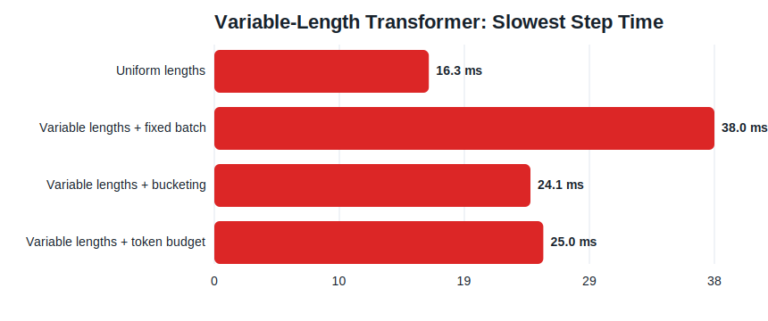
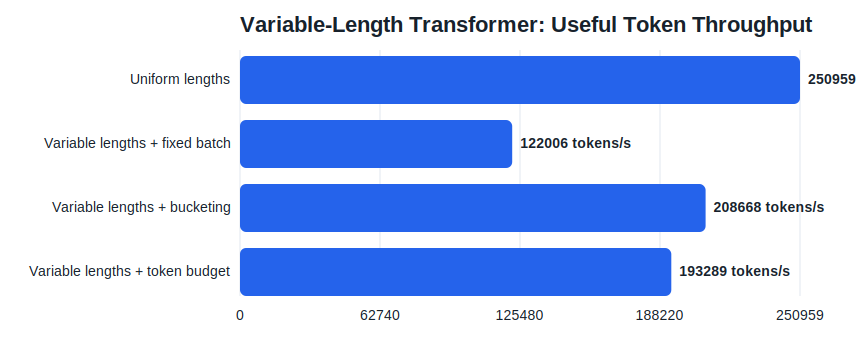
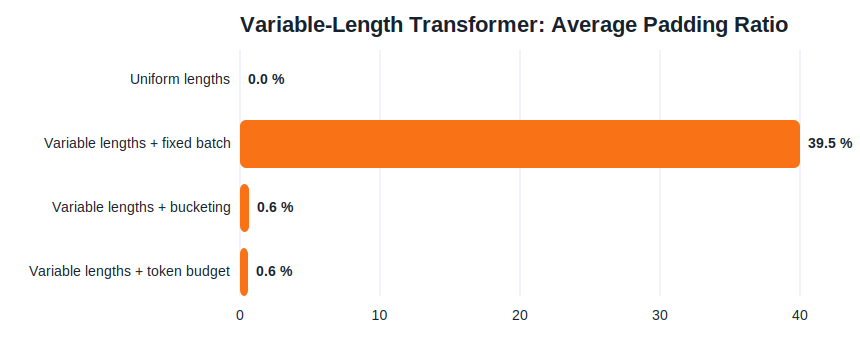
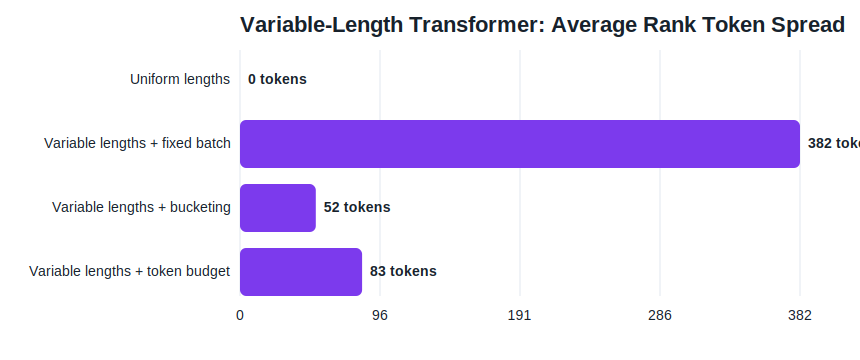
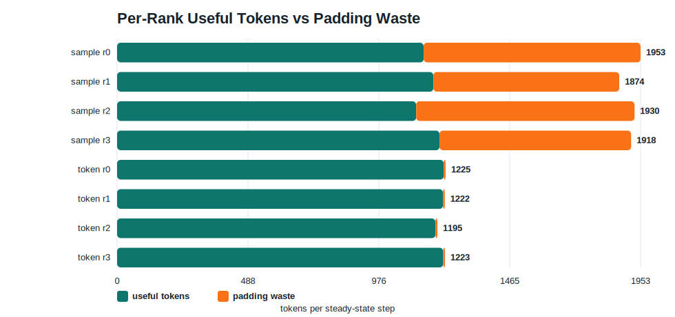

# Why Variable Sequence Length Breaks DDP Throughput

How to reproduce, measure, and fix token skew in transformer training with length bucketing and token-budget batching.

## TL;DR

In transformer training, DDP can look balanced by sample count while being badly imbalanced by actual work.

I built a small one-machine lab that uses a tiny transformer-like model with variable sequence lengths and four distributed ranks. The headline result was simple:

- uniform `128`-token batches: `250,959 tokens/s`
- variable lengths with fixed sample count: `122,006 tokens/s`
- variable lengths with length bucketing: `208,668 tokens/s`
- variable lengths with token-budget batching: `193,289 tokens/s`

The bad case was not a kernel problem. It was a batching problem:

- fixed sample count created `39.5%` average padding waste
- average per-step rank token spread reached `382 tokens`
- throughput dropped by `51.4%` relative to uniform-length batches

The two fixes behaved a little differently:

- length bucketing gave the best throughput in this synthetic setup
- token-budget batching produced the most even work with near-zero padding

The most important lesson is this:

> For transformer DDP jobs, the real unit of work is usually tokens, not samples.

## Why This Problem Shows Up So Often

Transformers make sequence length expensive in several places at once:

- CPU collation and padding
- host-to-device transfer volume
- attention FLOPs
- MLP FLOPs
- activation memory traffic
- backward time

That means two ranks can both process `8` samples and still do very different amounts of work if one batch contains many more total tokens than the other.

This is why DDP jobs with variable-length text often feel mysterious at first. You can look at per-rank batch size, see that it matches, and still have a job that scales badly.

## Setup

I used a small synthetic lab in this repo:

- experiment workload: [transformer_token_skew_lab.py](../python/playground_cuda/transformer_token_skew_lab.py)
- experiment runner: [transformer_token_skew_blog_experiments.py](../python/playground_cuda/transformer_token_skew_blog_experiments.py)

The lab uses:

- `world_size = 4`
- CPU `gloo` processes, so it works on a one-GPU machine
- a tiny transformer-like classifier with real attention work
- synthetic variable-length sequences with occasional long outliers

The generated artifacts for this post are checked in:

- timing table: [timings.csv](../reports/transformer_token_skew_blog/timings.csv)
- structured summaries: [results.json](../reports/transformer_token_skew_blog/results.json)
- charts:
  - [strategy_step_time.svg](../reports/transformer_token_skew_blog/charts/strategy_step_time.svg)
  - [strategy_useful_tokens_per_s.svg](../reports/transformer_token_skew_blog/charts/strategy_useful_tokens_per_s.svg)
  - [strategy_padding_ratio.svg](../reports/transformer_token_skew_blog/charts/strategy_padding_ratio.svg)
  - [strategy_token_spread.svg](../reports/transformer_token_skew_blog/charts/strategy_token_spread.svg)
  - [sample_vs_token_rank_work.svg](../reports/transformer_token_skew_blog/charts/sample_vs_token_rank_work.svg)
- raw logs:
  - [fixed_sample_ws4.log](../reports/transformer_token_skew_blog/fixed_sample_ws4.log)
  - [variable_sample_ws4.log](../reports/transformer_token_skew_blog/variable_sample_ws4.log)
  - [variable_bucket_ws4.log](../reports/transformer_token_skew_blog/variable_bucket_ws4.log)
  - [variable_token_ws4.log](../reports/transformer_token_skew_blog/variable_token_ws4.log)

## The Lab Design

The point of the lab is not to build a useful model. It is to isolate one question:

> What happens to distributed throughput when sequence lengths vary and batching policy is wrong?

The model uses real attention work so that padded length changes the compute cost:

```python
scores = torch.matmul(q, k.transpose(-1, -2)) / math.sqrt(head_dim)
scores = scores.masked_fill(~attn_mask, -1e4)
attn = torch.softmax(scores, dim=-1)
attended = torch.matmul(attn, v)
```

Each step also records the metrics I actually care about for this problem:

```python
useful_tokens = int(batch_lengths.sum().item())
padded_tokens = int(batch_lengths.max().item()) * len(batch_indices)
padding_ratio = 0.0 if padded_tokens == 0 else 1.0 - useful_tokens / padded_tokens
```

That gives me a per-rank view of:

- useful tokens
- padded tokens
- padding ratio
- step time
- data time
- compute time

## The Four Strategies

I compared four cases:

### 1. Uniform lengths

All samples are length `128`. This is the sanity-check baseline.

### 2. Variable lengths plus fixed sample count

Every rank gets a fixed `batch_size = 8`, regardless of token count.

This is the common bad default in real training code:

```python
loader = DataLoader(
    dataset,
    batch_size=per_rank_batch_size,
    sampler=sampler,
    collate_fn=collate_fn,
)
```

### 3. Variable lengths plus length bucketing

Each rank sorts local examples by length before forming fixed-size batches:

```python
local_sorted = sorted(local_indices, key=lengths.__getitem__)
batches = chunked(local_sorted, args.batch_size)
```

This strongly reduces padding waste.

### 4. Variable lengths plus token budget

Each rank builds batches until a padded-token budget is reached:

```python
projected_padded_tokens = next_max_len * (len(current_batch) + 1)
if current_batch and projected_padded_tokens > args.max_tokens_per_batch:
    batches.append(current_batch)
    current_batch = []
```

This tries to equalize actual work instead of raw sample count.

## The Result Table

These are the steady-state results from [timings.csv](../reports/transformer_token_skew_blog/timings.csv).

| Case | Slowest step ms | Useful tokens/s | Padding ratio | Avg rank token spread | Main takeaway |
| --- | ---: | ---: | ---: | ---: | --- |
| Uniform lengths | 16.3 | 250,959 | 0.0% | 0.0 | Ideal reference |
| Variable + fixed batch | 38.0 | 122,006 | 39.5% | 382.0 | Same samples, very different work |
| Variable + bucketing | 24.1 | 208,668 | 0.6% | 51.7 | Big win from simple batching change |
| Variable + token budget | 25.0 | 193,289 | 0.6% | 83.3 | Near-even work, slightly lower feed rate |

There are three things worth noticing immediately.

First, fixed sample count on variable lengths is terrible here.

Second, both bucketing and token-budget batching recover most of the lost performance.

Third, the best strategy depends on the optimization goal. In this setup, bucketing wins on raw throughput, while token budgeting gives the most directly controlled per-step work.

## Experiment 1: The Default Fixed-Batch Strategy Is Bad for Variable-Length Text

Here is the step-time view:



And the throughput view:



The fixed-batch variable-length case fell from:

- `250,959` to `122,006 tokens/s`

That is a `51.4%` throughput drop relative to the uniform baseline.

The reason is obvious once you look at padding:



Padding waste jumped to `39.5%`.

That means a huge fraction of the tokens moved through the step were not useful tokens at all. They were artifacts of batching sequences with very different lengths together.

And rank work was not even:



The average rank token spread per step reached `382 tokens`.

That is the real transformer skew story:

> The ranks looked balanced by sample count, but they were not balanced by tokens.

## Experiment 2: Length Bucketing Is the Cheapest High-Leverage Fix

In this lab, length bucketing was the biggest single improvement.

Compared with variable-length fixed batching, it changed the job from:

- `38.0 ms` to `24.1 ms` slowest step time
- `122,006` to `208,668 tokens/s`
- `39.5%` to `0.6%` padding ratio
- `382.0` to `51.7` average rank token spread

That is why bucketing is so often the first thing I recommend for transformer training pipelines. It is simple, local to the data path, and usually pays off immediately.

There is one nuance worth saying out loud:

This lab uses aggressive local sorting inside each rank. In a real training system you usually want shuffling at the bucket level rather than a globally monotonic length order. The engineering details change, but the principle does not:

- keep similarly sized sequences together
- stop paying for enormous padding waste

## Experiment 3: Token-Budget Batching Gives You Better Work Control

Token-budget batching also fixed the bad case:

- `38.0 ms` to `25.0 ms` step time
- `122,006` to `193,289 tokens/s`
- `39.5%` to `0.6%` padding ratio
- `382.0` to `83.3` token spread

The interesting thing is that token-budget batching was not the highest-throughput strategy in this synthetic setup. Bucketing still won by about `8.0%` on useful tokens per second.

That does not make token budgeting a bad idea. It just shows the trade-off clearly:

- bucketing here packed a little more useful work into each step
- token budgeting gave a tighter cap on per-step work and near-zero waste

In a real training job, token budgeting is often attractive because it lets you reason directly about:

- memory
- per-rank work fairness
- effective utilization under variable-length inputs

If you need a stable token load per rank, token budgeting is often the cleaner abstraction than “fixed number of samples.”

## Why Step-Time Skew Alone Can Be Misleading

One of the most interesting results in this experiment is that the bad fixed-batch case did not show a huge rank time spread:

- average rank time skew was only `0.46 ms`

At the same time:

- token spread was `382 tokens`
- padding waste was `39.5%`
- throughput was terrible

That is not a contradiction.

DDP has a way of hiding imbalance if you only look at end-of-step timing. Once ranks synchronize, the fast ranks can spend their advantage waiting, and the step times start looking deceptively similar.

This is why I care so much about token-level instrumentation.

If you only log:

- batch size
- step time
- examples/s

you can miss the real source of the slowdown.

If you also log:

- useful tokens
- padded tokens
- padding ratio
- tokens/s
- max sequence length

the problem becomes much easier to explain.

## The Best Comparison in the Whole Post

This chart compares per-rank useful tokens and padding waste for the bad fixed-batch strategy versus token-budget batching:



This is the picture I would keep in my head for real transformer DDP work:

- fixed sample count wastes a lot of padded work
- token-aware batching keeps most of the step focused on useful tokens

That is the practical meaning of “tokens, not samples.”

## What I Would Instrument in a Real Training Job

If I were debugging a real transformer DDP job tomorrow, I would add these metrics before touching kernels:

- per-rank useful tokens per step
- per-rank padded tokens per step
- per-rank padding ratio
- per-rank max sequence length
- tokens/s
- step time p50 and p95

If I could overlay one extra signal on a distributed trace, it would be per-rank tokens per step.

That one signal often explains a surprising amount of “mysterious” DDP behavior.

## What I Would Change First in Production

The fix list is short and high leverage:

1. Stop thinking in raw sample count.
2. Add length bucketing.
3. If the workload is still unstable, move to token-budget batching.
4. Watch `tokens/s`, not just `samples/s`.
5. Measure padding waste explicitly so you know whether the batching policy is actually helping.

If the task allows it, sequence packing belongs on this list too. Packing is often the next step after bucketing once you want to squeeze more useful tokens into the same memory footprint.

## Reproducing Everything

Generate the full dataset and charts:

```bash
uv run python -m playground_cuda.transformer_token_skew_blog_experiments
```

Run just the bad fixed-batch case:

```bash
uv run python -m torch.distributed.run --standalone --nproc_per_node=4 \
  -m playground_cuda.transformer_token_skew_lab \
  --strategy sample \
  --length-mode variable \
  --steps 12
```

Run the token-budget case:

```bash
uv run python -m torch.distributed.run --standalone --nproc_per_node=4 \
  -m playground_cuda.transformer_token_skew_lab \
  --strategy token \
  --length-mode variable \
  --max-tokens-per-batch 1280 \
  --steps 12
```

## Closing Thought

Variable-length transformer training creates one of the easiest DDP mistakes to make and one of the easiest to misdiagnose.

The job looks balanced because each rank sees the same number of samples. The job feels slow because each rank is actually doing different amounts of token work.

Once you switch your mental model from samples to tokens, a lot of DDP tuning decisions get simpler.
